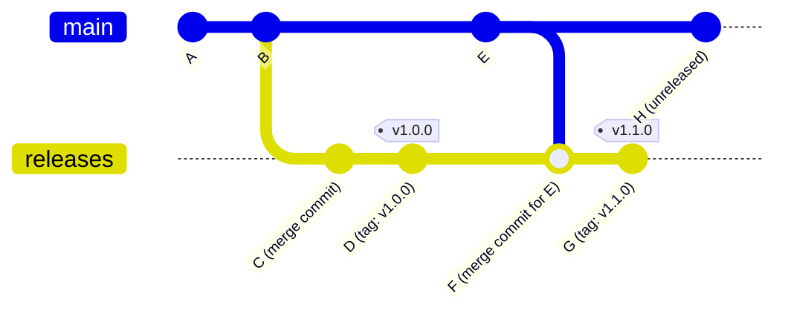

# Release branches

# What are release branches and why use them?

Some tech stacks use a central server to host production code. You update your code's metadata locally and then push code to the server. Examples:

- npmjs
- jsr.io
- Maven Central
- Apple App Store
- Google Play Store

For these stacks, the release process is simple. When you merge code to your trunk branch (e.g. `main`), you configure decaf... 
1. update your metadata files (e.g. `package.json`) with the new version 
2. push your code (including the metadata file updates) to the registry
3. update the single-source-of-truth and exit. 

You don't need to commit the updated metadata file back to the codebase — you just publish the new version and move on. **For these deployment processes, you do not need a release branch.**

Other tech stacks do not have a central repository. Instead, they have package managers that reference your git repository directly to pull down source code. Examples:

- Swift Package Manager
- GitHub Actions
- Go modules

For these stacks, the release process requires a couple more steps:
1. update your metadata files (e.g. `package.json`) with the new version 
2. commit the updated metadata file to your git repository and push it to your remote
3. make a git tag pointing to the new commit with the metadata update
4. update the single-source-of-truth and exit

For these types of deployments, you decide what branch to make the metadata-update commits on. You have two options:
**1. Make the metadata-update commits on your trunk branch (e.g. `main`).**

Pros: 
- Simpler setup and configuration. 

Cons: 
- Cluttered commit history on your trunk branch because of extra commits that are not part of your actual development work.
- If you use git branch protection rules, you may have a difficult time allowing decaf to push directly to your trunk branch. 

**2. Make the metadata-update commits on a separate release branch (e.g. `releases`).** 

Pros: 
- Keeps your trunk branch clean. 
- If you use git branch protection rules, it may be easier to allow decaf to push directly to your release branch instead of your trunk branch.

Cons: 
- Can be harder to tell what commit belongs to what release because the release commits/tags are on a different branch than the development commits.

## Examples of release branches

Here is a visual. `main` is the development/trunk branch that triggers decaf releases. `releases` is the release branch that hosts the release commits and tags.

Notice how `main` remains clean and linear, containing only development commits. The `releases` branch holds the extra metadata-update commits and tags.

[Here is a real-world release branch](https://github.com/levibostian/action-hide-sensitive-inputs/commits/latest/) for a GitHub Action project. The branch in this example is called `latest` instead of `releases`, but it serves the same purpose.

# How to set up decaf for release branches

Setting up decaf to use release branches involves a small amount of configuration, but is ultimately straightforward. The two areas that need attention are the **get latest release** step and the **deployment** step.

## Get latest release step

The "get latest release" step is responsible for finding the git commit that represents the latest release of your code. When using a release branch, your single source of truth is a git tag on the release branch — not the trunk branch. This means the step needs extra logic to bridge the two branches and find a commit they share.

A visual helps here. Given this repository state:

- `main` is the development/trunk branch where decaf runs.
- `releases` is the release branch that hosts the release commits and tags.
- The latest release is `v1.1.0`, associated with commit `G` on the `releases` branch.
- **decaf requires that the latest release commit exists on the current branch.** Because `G` is only on `releases` — not on `main` — decaf cannot find it and will assume there are no releases yet.
- The solution is to find the most recent commit that the current branch and the release branch have in common. In the diagram above, that common commit is `F`.

Your logic for the "get latest release" step should therefore be...

> Tip: If you happen to use GitHub Releases as your decaf single-source-of-truth, [here is a script you can use that does this logic for you](https://github.com/levibostian/decaf-script-github-releases-release-branch/). 

1. Fetch the latest git tag from the repository.
2. Locate the commit for that tag on the **release branch**. If no tag exists, treat this as the first release and exit early.
3. Starting from that tagged commit, walk backwards through the release branch's commit history.
4. For each commit, check whether that commit SHA also exists on the current branch (`main`).
5. The first commit found on both branches is the latest release commit. Return it.

## Deployment step

The deployment step is simpler. During the deployment process, check out the release branch, merge the current branch into it, make any metadata-update commits (e.g. bumping the version file), create the release tag, and push all changes. This is the point where your release branch is updated and the single source of truth — the new git tag — is established, pointing to a commit on the release branch.

[Here is an example script](https://github.com/levibostian/action-hide-sensitive-inputs/blob/5519f11abc21c18a1115ef64b8032ba424843a82/scripts/deploy.ts) for the deployment step that uses a release branch. 

Here are some decaf scripts that may be helpful for this step:
- [`decaf-script-git`: Set of git operations such as merge, commit, and push](https://github.com/levibostian/decaf-script-git) to help you update your release branch.

